# 01. LangChain 입문

> 본 장에서는 LangChain이 무엇이며 왜 등장했는지, 그리고 LangChain을 구성하는 핵심 요소인 **Model**, **Memory** 와 그 위에 얹히는 **LangGraph / LangSmith** 가 무엇인지 학습합니다.

---

## 1장. What is LangChain ?

### 1.1 LangChain이란 무엇인가?

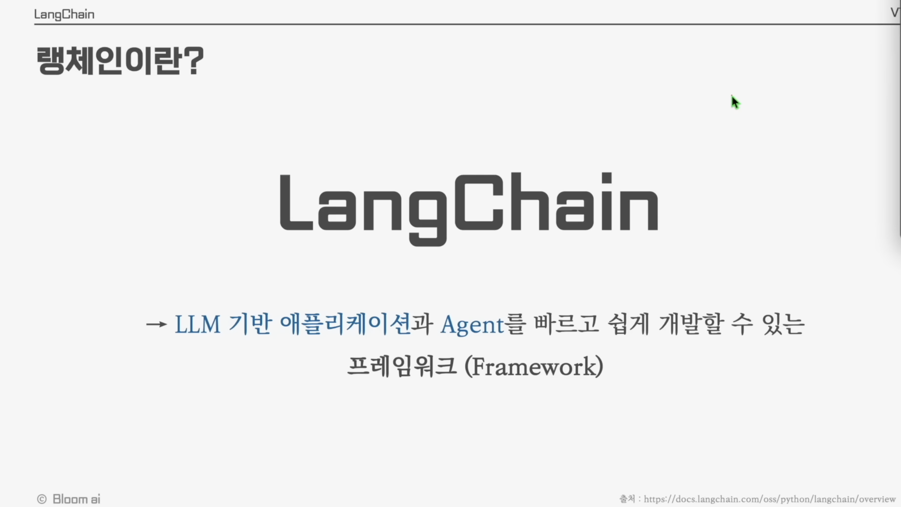

**LangChain**은 LLM(대형 언어 모델)을 기반으로 한 **애플리케이션과 Agent**를 빠르고 쉽게 개발할 수 있도록 도와주는 **프레임워크(Framework)** 입니다.

- LLM 호출, 프롬프트 관리, 외부 데이터 연결, 메모리 관리, 도구(Tool) 사용 등 LLM 애플리케이션 개발에 반복적으로 필요한 기능을 표준화된 인터페이스로 제공합니다.
- 덕분에 개발자는 인프라 작업 대신 **비즈니스 로직과 Agent 설계**에 집중할 수 있습니다.

> 출처 : [LangChain 공식 문서](https://docs.langchain.com/oss/python/langchain/overview)

---

### 1.2 LLM 애플리케이션 vs LLM Agent

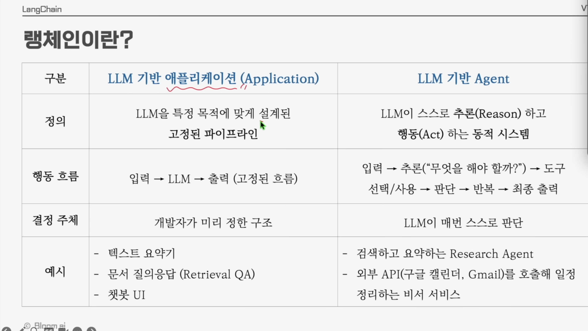

LangChain으로 만들 수 있는 시스템은 크게 두 가지 형태로 나눌 수 있습니다.

| 구분          | LLM 기반 애플리케이션 (Application)              | LLM 기반 Agent                                                            |
| :------------ | :----------------------------------------------- | :------------------------------------------------------------------------ |
| **정의**      | LLM을 특정 목적에 맞게 설계된 **고정된 파이프라인** | LLM이 스스로 **추론(Reason)** 하고 **행동(Act)** 하는 **동적 시스템**     |
| **행동 흐름** | 입력 → LLM → 출력 (고정된 흐름)                  | 입력 → 추론("무엇을 해야 할까?") → 도구 선택/사용 → 판단 → 반복 → 최종 출력 |
| **결정 주체** | 개발자가 미리 정한 구조                          | LLM이 매번 스스로 판단                                                    |
| **예시**      | 텍스트 요약기 / 문서 질의응답(Retrieval QA) / 챗봇 UI | 검색·요약 Research Agent / 외부 API(구글 캘린더, Gmail)를 호출하는 비서 서비스 |

> 💡 **핵심 차이**: 애플리케이션은 "정해진 길"을 따라가지만, Agent는 **상황에 맞춰 길을 선택**합니다.

---

### 1.3 Agent의 정의와 구성 요소

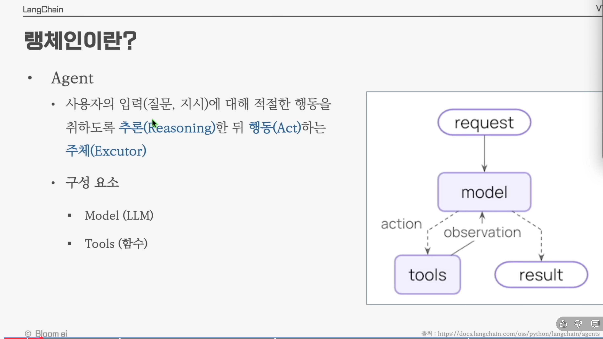

**Agent**란 사용자의 입력(질문, 지시)에 대해 적절한 행동을 취하도록 **추론(Reasoning)** 한 뒤 **행동(Act)** 하는 **주체(Executor)** 입니다.

#### Agent의 구성 요소

- **Model (LLM)** : 추론과 의사결정을 담당하는 두뇌
- **Tools (함수)** : 실제 행동(검색, 계산, API 호출 등)을 수행하는 손과 발

#### Agent의 동작 흐름

```
request → model → action(tools) → observation → model → result
```

1. **request** : 사용자의 요청이 모델에 전달됨
2. **model** : 어떤 도구를 사용할지, 또는 바로 답변할지 추론
3. **action** : 선택된 tool을 실행
4. **observation** : tool의 실행 결과를 모델에게 다시 전달
5. **반복**: 충분한 정보가 모일 때까지 위 과정을 반복하다가 **result**(최종 답변) 생성

---

### 1.4 LangChain의 진화 — v0에서 v1으로

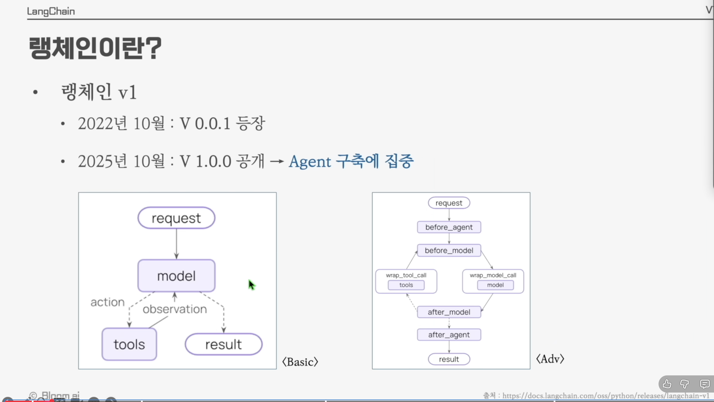

- **2022년 10월** : `v0.0.1` 등장 → LLM을 "Chain"으로 엮어 사용하는 데 초점
- **2025년 10월** : `v1.0.0` 공개 → **Agent 구축에 집중**

#### Basic 구조 vs Advanced 구조

- **Basic** : `request → model → tools → result` 의 단순한 흐름
- **Advanced** : 각 단계 앞뒤로 훅(hook)을 둘 수 있어 더 정교한 제어가 가능
  - `before_agent` / `before_model` / `wrap_model_call` / `wrap_tool_call` / `after_model` / `after_agent`

> 💡 v1부터는 단순한 LLM 호출 체인을 넘어, **에이전트 단계마다 검증·로깅·가공 로직을 끼워 넣을 수 있는 구조**를 표준으로 제공합니다.

---

### 1.5 LangChain의 철학

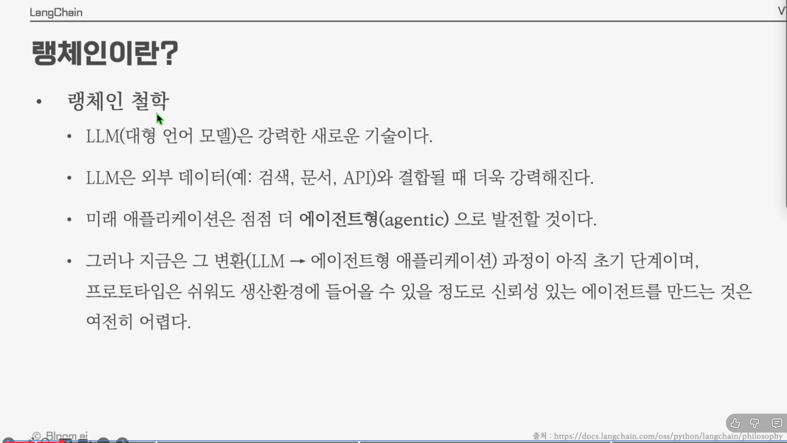

LangChain이 왜 만들어졌는지를 이해하면, 이 도구를 어떤 사고방식으로 써야 하는지가 분명해집니다.

1. **LLM(대형 언어 모델)은 강력한 새로운 기술이다.**
2. **LLM은 외부 데이터(예: 검색, 문서, API)와 결합될 때 더욱 강력해진다.**
3. 미래 애플리케이션은 점점 더 **에이전트형(agentic)** 으로 발전할 것이다.
4. 그러나 지금은 그 변환(LLM → 에이전트형 애플리케이션) 과정이 아직 초기 단계이며, 프로토타입은 쉬워도 **생산 환경에 들어갈 수 있을 정도로 신뢰성 있는 에이전트를 만드는 것은 여전히 어렵다.**

> 📌 LangChain은 "신뢰성 있는 에이전트를 만들기 어렵다"는 문제를 풀기 위한 도구입니다.

---

## 2장. Model

LLM 기반 애플리케이션과 Agent의 **두뇌** 역할을 하는 것이 Model입니다. 본 장에서는 Model의 역할, 텍스트 생성 방법, 그리고 구조화된 답변 생성을 다룹니다.

---

### 2.1 Model의 역할

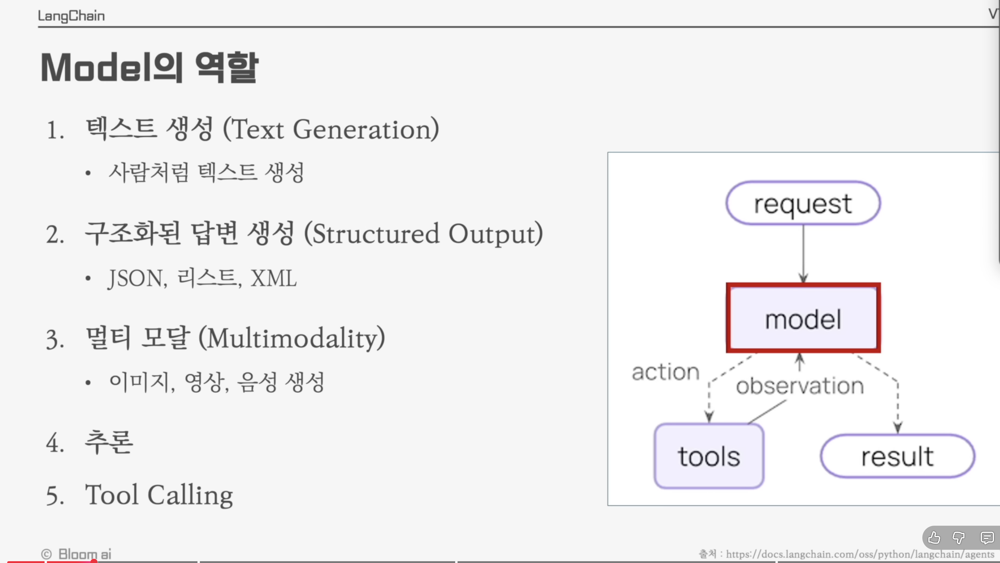

LangChain에서 Model은 다음과 같은 다섯 가지 역할을 수행합니다.

1. **텍스트 생성 (Text Generation)** — 사람처럼 자연스럽게 텍스트 생성
2. **구조화된 답변 생성 (Structured Output)** — JSON, 리스트, XML 등 정해진 포맷으로 출력
3. **멀티 모달 (Multimodality)** — 이미지, 영상, 음성 생성
4. **추론 (Reasoning)** — 복잡한 문제를 단계적으로 풀어냄
5. **Tool Calling** — 외부 함수/API를 호출

> 💡 Agent의 동작 흐름에서 **model 노드**가 바로 이 다섯 가지 역할을 담당합니다.

---

### 2.2 텍스트 생성 (Text Generation)

#### 2.2.1 가장 기본적인 사용법

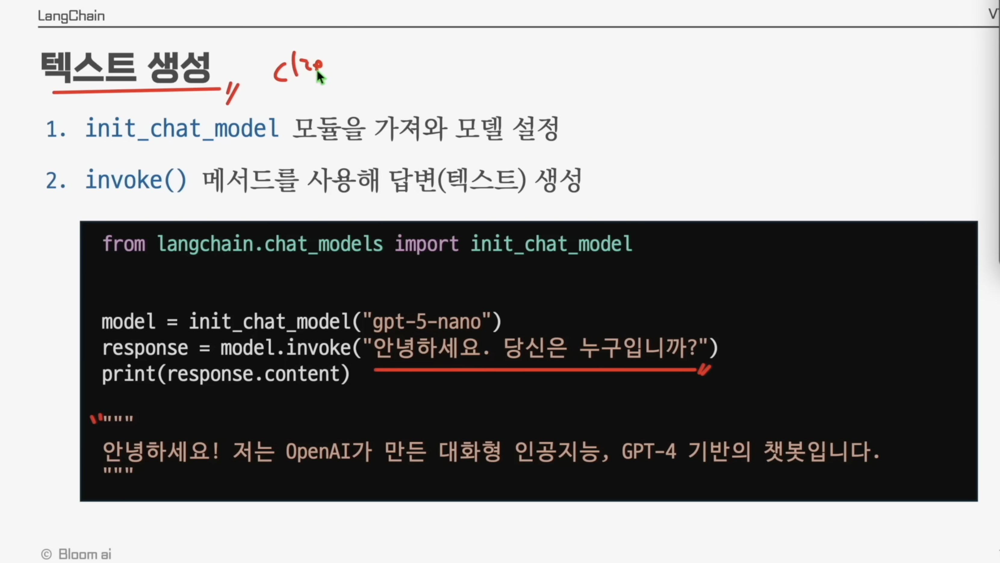

LangChain에서 모델을 사용하는 흐름은 단 두 줄입니다.

1. **`init_chat_model`** 모듈을 가져와 모델을 설정
2. **`invoke()`** 메서드를 사용해 답변(텍스트) 생성

```python
from langchain.chat_models import init_chat_model

model = init_chat_model("gpt-5-nano")
response = model.invoke("안녕하세요. 당신은 누구입니까?")
print(response.content)
# 안녕하세요! 저는 OpenAI가 만든 대화형 인공지능, GPT-4 기반의 챗봇입니다.
```

> 📝 `invoke`는 영어로 *"부르다, 선포하다"* 라는 뜻으로, 모델을 한 번 호출해 응답을 받는 동기 방식입니다.

---

#### 2.2.2 init_chat_model 파라미터

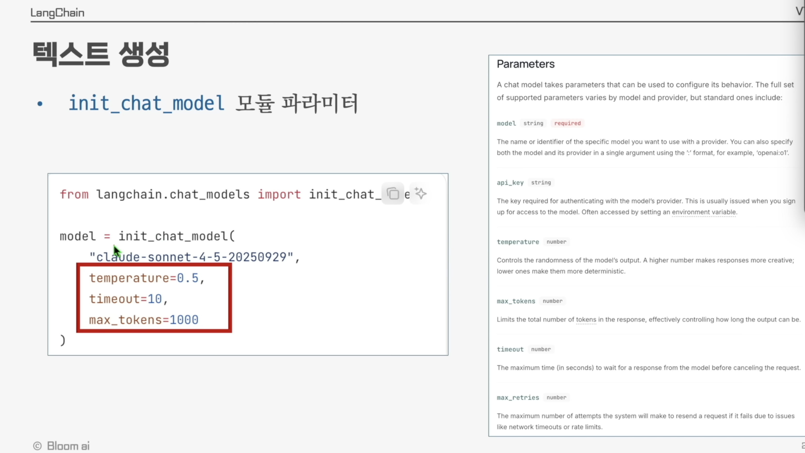

모델은 다양한 파라미터로 동작을 조절할 수 있습니다.

```python
from langchain.chat_models import init_chat_model

model = init_chat_model(
    "claude-sonnet-4-5-20250929",
    temperature=0.5,
    timeout=10,
    max_tokens=1000
)
```

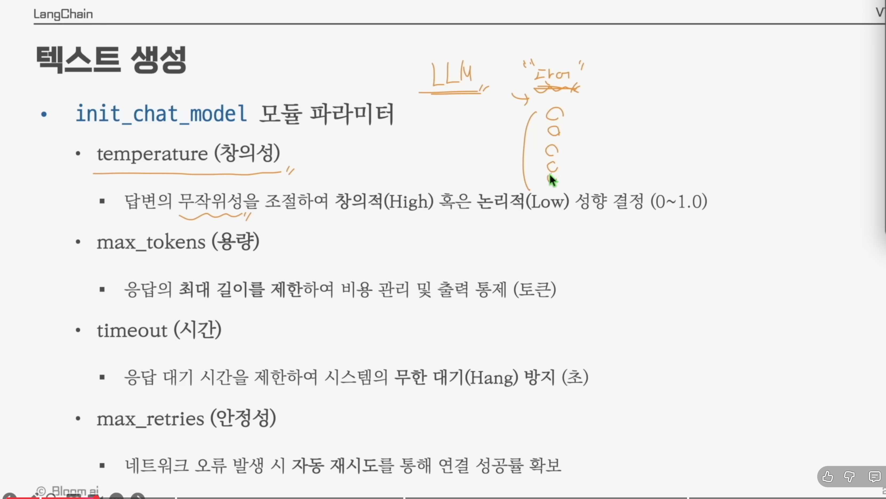

#### 주요 파라미터 정리

| 파라미터        | 의미       | 설명                                                                |
| :-------------- | :--------- | :------------------------------------------------------------------ |
| `temperature`   | **창의성** | 답변의 무작위성을 조절해 창의적(High) 혹은 논리적(Low) 성향 결정 (0 ~ 1.0) |
| `max_tokens`    | **용량**   | 응답의 **최대 길이를 제한**하여 비용 관리 및 출력 통제 (단위: 토큰) |
| `timeout`       | **시간**   | 응답 대기 시간을 제한하여 시스템의 무한 대기(Hang) 방지 (단위: 초)   |
| `max_retries`   | **안정성** | 네트워크 오류 발생 시 자동 재시도를 통해 연결 성공률 확보            |

> 💡 **temperature 직관적 이해** : 같은 프롬프트라도 `temperature=0`이면 거의 같은 답이, `temperature=1`이면 매번 다른 답이 나옵니다.

---

#### 2.2.3 invoke 외의 호출 방식 — stream과 batch

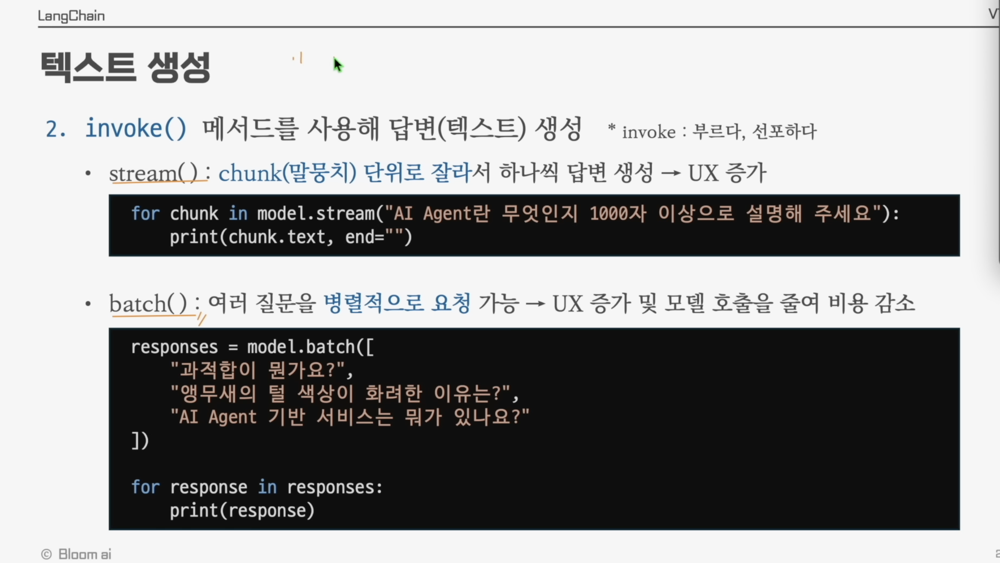

`invoke()`는 답변이 모두 생성될 때까지 기다리는 방식입니다. 그 외에도 두 가지 호출 방식이 더 있습니다.

##### ① `stream()` — 청크(말뭉치) 단위로 잘라서 답변 생성

답변을 한 글자씩(또는 토큰 단위로) 흘려보내며 사용자에게 즉시 표시할 수 있어 **UX가 좋아집니다**(ChatGPT처럼 글자가 흐르듯 나타나는 효과).

```python
for chunk in model.stream("AI Agent란 무엇인지 1000자 이상으로 설명해 주세요"):
    print(chunk.text, end="")
```

##### ② `batch()` — 여러 질문을 병렬적으로 요청

여러 개의 입력을 **동시에 처리**하여 응답 시간을 줄이고, 모델 호출 횟수를 줄여 **비용을 감소**시킵니다.

```python
responses = model.batch([
    "과적합이 뭔가요?",
    "앵무새의 털 색상이 화려한 이유는?",
    "AI Agent 기반 서비스는 뭐가 있나요?"
])

for response in responses:
    print(response)
```

> 💡 **언제 어떤 방식을 쓸까?**
> - **invoke** : 단일 요청, 즉시 답변 필요
> - **stream** : 챗봇 UI처럼 실시간 출력이 중요할 때
> - **batch** : 평가, 데이터 가공 등 다수 입력을 한 번에 처리할 때

---

### 2.3 구조화된 답변 생성 (Structured Output)

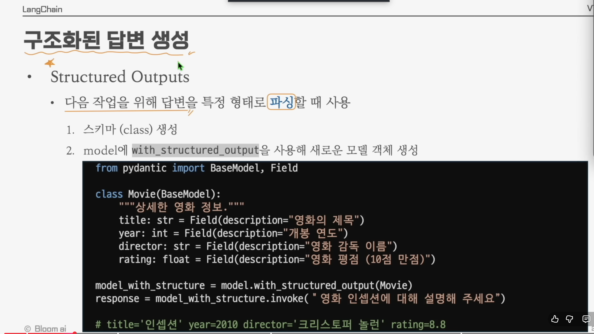

#### 2.3.1 Structured Output이 필요한 이유

LLM의 기본 답변은 자연어 문장입니다. 하지만 실제 애플리케이션에서는 **다음 작업을 위해 답변을 특정 형태로 파싱**해야 할 때가 많습니다(예: DB 저장, API 응답, 후속 함수 호출).

이때 사용하는 것이 **Structured Output** 입니다.

#### 사용 절차

1. **스키마(class) 생성** — 원하는 출력 구조를 Pydantic 클래스로 정의
2. **모델에 `with_structured_output`** 을 사용해 새로운 모델 객체 생성

```python
from pydantic import BaseModel, Field

class Movie(BaseModel):
    """상세한 영화 정보."""
    title: str = Field(description="영화의 제목")
    year: int = Field(description="개봉 연도")
    director: str = Field(description="영화 감독 이름")
    rating: float = Field(description="영화 평점 (10점 만점)")

model_with_structure = model.with_structured_output(Movie)
response = model_with_structure.invoke("영화 인셉션에 대해 설명해 주세요")
# title='인셉션' year=2010 director='크리스토퍼 놀런' rating=8.8
```

---

#### 2.3.2 스키마 생성 — Pydantic 활용

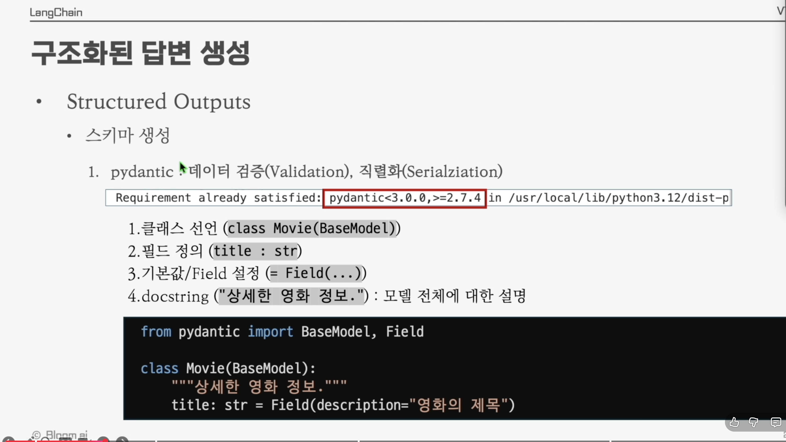

스키마는 **Pydantic** 라이브러리로 정의합니다. Pydantic은 **데이터 검증(Validation)** 과 **직렬화(Serialization)** 를 모두 제공합니다.

```bash
# pydantic >= 2.7.4 권장
pip install "pydantic>=3.0.0,>=2.7.4"
```

#### Pydantic 모델의 4가지 구성 요소

1. **클래스 선언** : `class Movie(BaseModel)`
2. **필드 정의** : `title : str`
3. **기본값 / Field 설정** : `= Field(...)`
4. **docstring** : `"""상세한 영화 정보."""` → 모델 전체에 대한 설명 (LLM이 참고)

```python
from pydantic import BaseModel, Field

class Movie(BaseModel):
    """상세한 영화 정보."""
    title: str = Field(description="영화의 제목")
```

> 💡 `Field(description=...)` 의 설명은 LLM에게 **이 필드에 어떤 값을 채워야 하는지** 알려주는 힌트로 사용됩니다.

---

#### 2.3.3 JSON Schema vs Pydantic

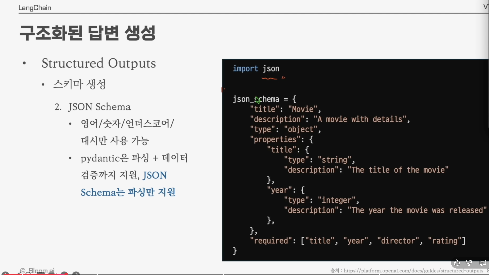

스키마는 JSON Schema 형식으로도 정의할 수 있습니다.

```python
import json

json_schema = {
    "title": "Movie",
    "description": "A movie with details",
    "type": "object",
    "properties": {
        "title": {
            "type": "string",
            "description": "The title of the movie"
        },
        "year": {
            "type": "integer",
            "description": "The year the movie was released"
        },
    },
    "required": ["title", "year", "director", "rating"],
}
```

#### Pydantic vs JSON Schema 비교

| 특징           | JSON Schema                          | Pydantic                                |
| :------------- | :----------------------------------- | :-------------------------------------- |
| **사용 가능 문자** | 영어 / 숫자 / 언더스코어 / 대시      | 파이썬 식별자 규칙                      |
| **역할**       | 데이터 구조의 **명세서** (문서화용)  | 데이터의 **실행기 및 검사기** (코드용)  |
| **언어**       | 언어 독립적 (JSON 포맷)              | 파이썬 (Python Class 기반)              |
| **검증 시점**  | 별도의 검증 라이브러리 필요          | **객체를 생성하는 순간** 즉시 검증      |
| **지원 범위**  | **파싱만 지원**                      | **파싱 + 데이터 검증** 모두 지원        |
| **주요 용도**  | API 문서(Swagger), 데이터 규격 공유  | FastAPI 서버, LangChain 데이터 모델링   |

---

#### 📌 보충 — Pydantic의 검증(Validation)이란?

**Pydantic**이 데이터 검증(Validation)을 해준다는 말은, 단순히 데이터의 "모양(구조)"만 정의하는 것이 아니라, **"실제로 들어온 데이터가 내가 정한 규칙에 맞는지 실시간으로 검사하고, 틀리면 에러를 내거나 올바른 타입으로 바꿔준다"** 는 뜻입니다.

비유하자면, **JSON Schema**는 *"이 서류 양식은 이름(문자), 나이(숫자)로 구성되어야 함"* 이라는 **설명서**이고, **Pydantic**은 그 서류를 받자마자 *"나이 칸에 문자가 써있네? 다시 써와!"* 라고 잡아내는 **현장 검사원**과 같습니다.

##### ① 예시 코드로 보는 차이

만약 우리가 '나이'는 0세 이상이어야 하고, '이메일'은 형식에 맞아야 한다는 규칙을 정했다고 합시다.

```python
from pydantic import BaseModel, Field, EmailStr, ValidationError

# 1. Pydantic 모델 정의 (규칙 세우기)
class User(BaseModel):
    name: str                           # 이름은 반드시 문자열이어야 함
    age: int = Field(ge=0, le=120)      # 나이는 0 이상 120 이하의 정수여야 함
    email: EmailStr                     # 이메일 형식이어야 함 (pydantic[email] 설치 필요)

# 2. 올바른 데이터 입력 (정상 작동)
user1 = User(name="Alice", age=25, email="alice@example.com")
print(user1.age)  # 25

# 3. 잘못된 데이터 입력 (검증 기능 작동!)
try:
    # 나이에 음수를 넣거나, 이메일 형식이 아닌 문자열을 넣으면?
    user2 = User(name="Bob", age=-5, email="not-an-email")
except ValidationError as e:
    print("검증 에러 발생!")
    print(e)
```

##### ② Pydantic이 해주는 구체적인 일들

**가. 타입 강제 변환 (Type Coercion)**

데이터가 살짝 틀려도 말이 되면 알아서 고쳐줍니다.

- 입력: `age="25"` (문자열)
- 결과: Pydantic이 `25` (정수)로 자동 변환해서 저장합니다. (JSON Schema는 그냥 틀렸다고만 합니다.)

**나. 값의 범위 및 제약 사항 검사**

단순히 "숫자다"를 넘어 "10보다 커야 한다", "글자 수가 5글자 이상이어야 한다" 같은 세밀한 검사를 수행합니다.

- `Field(min_length=2)`: 이름은 최소 2글자 이상이어야 함.

**다. 복잡한 구조 검증**

리스트 안에 특정 객체가 들어있는 구조 등 복잡한 중첩 데이터도 한꺼번에 검사합니다.

##### ③ 결론 — 왜 Pydantic을 쓰는가?

LangChain에서 Pydantic을 쓰는 이유는 **LLM이 내뱉는 불안정한 텍스트 데이터를 우리가 원하는 깨끗하고 정확한 파이썬 객체로 안전하게 변환**하기 위해서입니다. 검증에 실패하면 바로 에러를 내주기 때문에 프로그램이 엉뚱한 데이터로 돌아가는 것을 막아줍니다.

---

## 3장. Memory

LLM은 기본적으로 **이전 대화를 기억하지 못합니다**(stateless). 따라서 챗봇처럼 맥락을 유지하는 애플리케이션을 만들려면 직접 대화 기록을 관리해야 합니다. 본 장에서는 LangChain에서 메모리를 어떻게 구현하는지 다룹니다.

---

### 3.1 메시지 구성 요소


LangChain에서 LLM에 전달하는 입력은 **메시지(Message)** 의 리스트입니다. 메시지의 종류는 크게 세 가지입니다.

| 메시지 종류         | 역할                                       |
| :------------------ | :----------------------------------------- |
| **System Message**  | 개발자가 사전에 작성한 입력 (프롬프트, 페르소나) |
| **Human Message**   | 사용자의 요청(request), 입력                 |
| **AI Message**      | Model의 답변 (result)                       |

```python
[
    SystemMessage("당신은 유능한 로켓 전문가 입니다."),
    HumanMessage("안녕하세요. 궁금한 게 있어요!"),
    AIMessage("로켓의 기본 원리나 추진 발사 차이 등...")
]
```

> 💡 메모리란 결국 이 **메시지 리스트를 어떻게 누적·관리할 것인가**의 문제입니다.

---

### 3.2 예시 코드 1 — Message 객체 사용


LangChain의 메시지 클래스(`SystemMessage`, `HumanMessage`)를 사용하는 가장 기본적인 방식입니다.

```python
from langchain.chat_models import init_chat_model
from langchain.messages import HumanMessage, SystemMessage

model = init_chat_model("gpt-5-nano")

system_msg = SystemMessage("당신은 유능한 로켓 전문가입니다.")
human_msg = HumanMessage("안녕하세요. 궁금한 게 있어요")

messages = [system_msg, human_msg]
response = model.invoke(messages)  # AIMessage 반환

print(response)  # content='로켓의 기본 원리 추진 발사 차이 등... '
```

> 📝 `invoke`에 **단일 문자열** 대신 **메시지 리스트**를 넘길 수 있고, 이때 모델은 전체 대화 맥락을 바탕으로 응답합니다.

---

### 3.3 예시 코드 2 — 딕셔너리 포맷 (OpenAI 스타일)

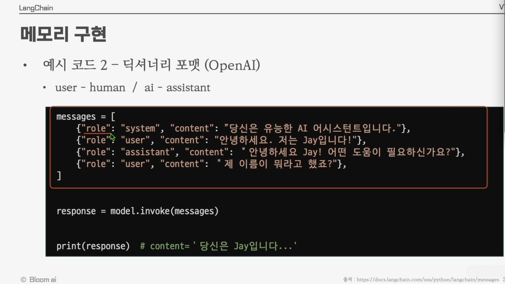

OpenAI API와 동일한 **딕셔너리 형식**으로도 메시지를 전달할 수 있습니다.

#### Role 매핑

- `user` ↔ `human`
- `assistant` ↔ `ai`
- `system` ↔ `system`

```python
messages = [
    {"role": "system",    "content": "당신은 유능한 AI 어시스턴트입니다."},
    {"role": "user",      "content": "안녕하세요. 저는 Jay입니다!"},
    {"role": "assistant", "content": "안녕하세요 Jay! 어떤 도움이 필요하신가요?"},
    {"role": "user",      "content": "제 이름이 뭐라고 했죠?"},
]

response = model.invoke(messages)
print(response)  # content='당신은 Jay입니다...'
```

> 💡 위 예시처럼 **이전 대화(assistant 답변 포함)를 messages에 함께 넣어주면 모델은 맥락을 기억한 것처럼 동작**합니다. 이것이 LLM 메모리 구현의 가장 단순한 형태입니다.

---

### 3.4 LangGraph

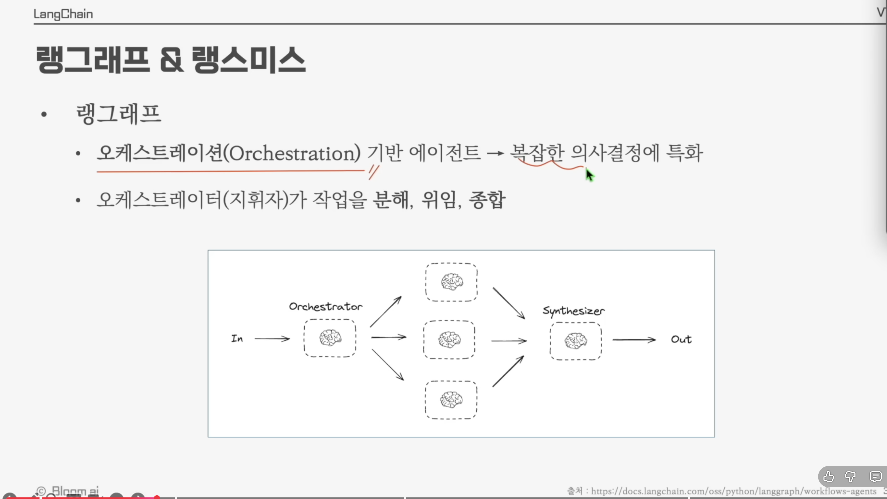

**LangGraph**는 **오케스트레이션(Orchestration) 기반 에이전트** 프레임워크로, **복잡한 의사결정에 특화** 되어 있습니다.

- **오케스트레이터(지휘자)** 가 작업을 **분해(decompose) → 위임(delegate) → 종합(synthesize)** 하는 흐름을 그래프로 표현합니다.
- 여러 개의 LLM/도구 노드를 노드(node)와 엣지(edge)로 연결하여 **분기·반복·병렬 처리**가 가능한 워크플로우를 구축할 수 있습니다.

```
        ┌──> 🧠 ──┐
In ─> Orchestrator ──> 🧠 ──> Synthesizer ─> Out
        └──> 🧠 ──┘
```

> 💡 LangChain의 `Agent` 가 단순한 루프(loop) 라면, LangGraph는 **그래프 형태의 자유로운 흐름 제어**가 가능한 상위 레벨 도구라고 이해하면 됩니다. 메모리(상태) 또한 그래프의 노드 사이에서 공유·전달되며, 본격적인 멀티턴 에이전트는 LangGraph 위에서 구현하게 됩니다.

---

### 3.5 LangSmith

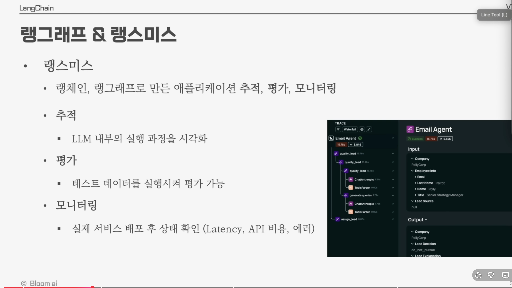

**LangSmith**는 **랭체인·랭그래프로 만든 애플리케이션을 추적·평가·모니터링** 할 수 있도록 도와주는 도구입니다.

#### 주요 기능

| 기능       | 설명                                                              |
| :--------- | :---------------------------------------------------------------- |
| **추적**   | LLM 내부의 실행 과정을 시각화 (어떤 프롬프트가 어떤 응답을 만들었는지) |
| **평가**   | 테스트 데이터를 실행시켜 모델/에이전트 성능을 평가 가능              |
| **모니터링** | 실제 서비스 배포 후 상태 확인 (Latency, API 비용, 에러)              |

> 💡 **개발 → 평가 → 배포 → 운영** 의 모든 단계를 한 곳에서 관찰할 수 있어, 신뢰성 있는 Agent를 만들기 위한 필수 도구입니다.

---

## 📚 1장 정리

- **LangChain** 은 LLM 애플리케이션과 Agent를 빠르게 만들 수 있는 프레임워크다.
- **Agent** 는 추론(Reason) + 행동(Act) 을 반복하는 주체이며, **Model + Tools** 로 구성된다.
- **Model** 은 다섯 가지 역할(텍스트 생성, 구조화 출력, 멀티모달, 추론, Tool Calling) 을 한다.
  - `init_chat_model` 로 모델 생성, `invoke / stream / batch` 로 호출
  - **Pydantic** 으로 스키마를 정의해 **구조화된 답변** 을 받을 수 있다.
- **Memory** 는 `SystemMessage / HumanMessage / AIMessage` 의 리스트를 누적·관리하여 구현한다.
- 같은 3장 안에서 다룬 **LangGraph** 는 복잡한 오케스트레이션을, **LangSmith** 는 추적·평가·모니터링을 담당한다.
